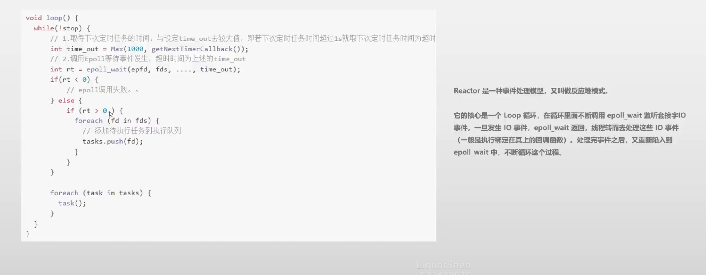

# Rpc框架

## 依赖库

### protobuf

### tinyxml2


## 日志模块

主要采用异步日志

首先同步日志

日志模块  

```
1. 日志级别
2. 打印到文件，支持日期命名， 以及日志的滚动
3. c格式化
4. 线程安全
```

LogLevel：级别

```
Debug
Info
Error
```

LogEvenet：日志事件

```
文件名、行号
Msg
进程id
Thread id
日期、时间精确到毫秒
自定义的消息
```

打印日志格式：

```
[level][%y-%m-%d %H:%M:%s.%ms]\t[pid:thread_id]\t[file_name:line][%msg]
```

Logger 日志器

```
1. 提供打印日志的方法
2. 设置输出的路径
```


### 可变参数模板

c++可变参数是指函数的参数个数是可变的，可以再函数定义时不确定参数的个数，需要在函数体内通过特定的语法来处理这些参数

```c++
template<typename... Args>
std::string formatString(const char* str, Args&&... args) {
    int size = snprintf(nullptr, 0, str, std::forward<Args>(args)...);
    std::string result;
    if (size > 0) {
        result.resize(size);
        snprintf(&result[0], size + 1, str, std::forward<Args>(args)...);
    }
    return result;
}
```

**通用的字符串格式化函数**

+ ``template<typename... Args>``是可变参数模板，表示函数可以接受任意数量、任意类型的参数。`Args`是一个模板参数包，用于捕获传入的所有实参类型

- **`Args&&... args`**：使用了**万能引用（universal reference）** 和**参数包展开**。`&&` 在这里不是右值引用，而是万能引用，结合 `std::forward` 可以实现参数的**完美转发**（保持原始参数的左值 / 右值属性），`...` 表示展开参数包，即接受与模板参数包匹配的任意数量实参。

`snprintf`格式化字符串的函数：将**格式化的数据写入指定的字符串缓冲区**

```c
int snprintf(char *str, size_t size, const char *format, ...);
```

当str为空，size=0时，只会返回传入的格式化字符串的大小（**不包含终止符的长度**）

+ size是字符串的长度 + '\0'终止符

当字符串的长度 > 0：

+ 将字符串传给result，在调用``snprintf``时，要保证传入的长度是字符的长度+1

### ``sstream``

字符串流类，用于字符串与各种数据类型之间的转换以及字符串的拼接、分割等操作

+ 创建对象：`std::stringstream ss`

+ 操作流：输出操作（向流中写入数据）:`ss << 数据`

​	输入操作（从流中读取数据）：`ss >> 变量`

+ 获取结果：通过 `ss.str()` 获取流中的字符串

## 配置模块

tinyxml2


## EventLoop模块

Reactor模块，主线程是一个循环不断地从epoll_wait中获取事件，一旦获得事件，就让别的线程处理事件



### 任务队列

```c++
std::unique_lock<std::mutex> locker(task_mtx_);
std::queue<std::function<void()>> tmp_tasks;
m_pending_tasks.swap(tmp_tasks);    // 当前的任务队列与临时队列交换
locker.unlock();
```

`m_pending_tasks`中已经没有任务了，交换后，`m_pending_tasks` 变为空队列（不再有任务），而所有原任务都保存在 `tmp_tasks` 中。后续可以安全地操作 `tmp_tasks`（此时已解锁，不影响其他线程对 `m_pending_tasks` 的修改）。

### 初始化

### TCP连接过程

创建socket -> bind IP地址和端口 -> listen 设置为监听套接字

至此此文件描述符变为监听状态的文件描述符

### 流程

在`test_eventloop`中：

```c++
event.listen(lynns::FdEvent::IN_EVENT, [&fd](){
        sockaddr_in peer_addr;
        socklen_t addr_len = 0;
        memset(&peer_addr, 0, sizeof(peer_addr));
        int clientfd = accept(fd, reinterpret_cast<sockaddr*>(&peer_addr), &addr_len);
        DEBUGLOG("sucess get client fd:[%d], peer addr: [%s:%d]", clientfd, inet_ntoa(peer_addr.sin_addr), ntohs(peer_addr.sin_port));
 });
```

将此文件描述符的事件状态设置为可读事件，回调函数为：

```
当可读事件触发时，通过accept获取客户端的连接socket，并输出客户端的地址和端口信息
```

```c++
eventloop->addEpollEvent(&event);
```

将此``fdEvent``添加到``eventloop``中：**将此fd以注册到epoll中**


调用``epoll_wait``之后，将发生的事件返回到创建的``epoll_event``数组中，从``epoll_event``中取与``fdEvent``绑定的``epoll_event.data.ptr``，并根据epoll_event的事件类型，将响应的任务添加到任务队列中；在写一次循环开始处理任务。

